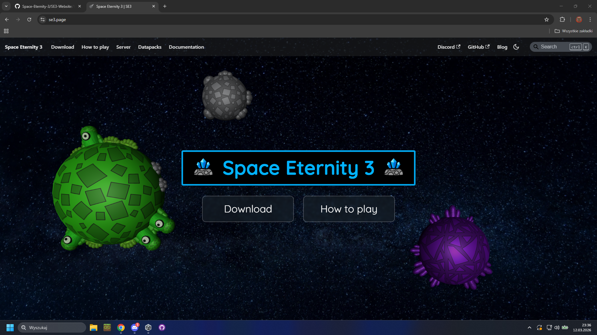
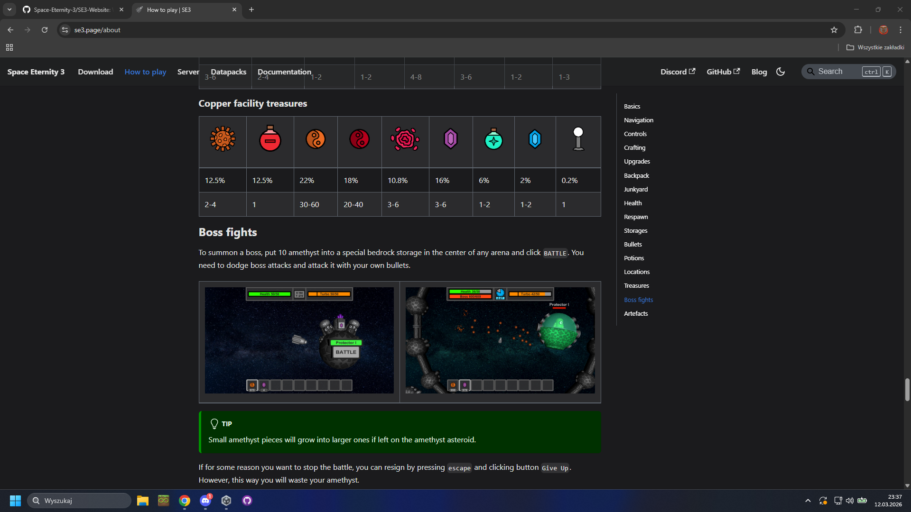

# SE3-Website

This is a project that stores a source code of the official **Space Eternity 3 website**. It was made using Docusaurus and has a configured auto-deploy from the main branch. See the final result [here](https://se3.page).

## Preview

|  |
| ------------------------------- |
|  |

## How to run?

First, ensure that you have the following **prerequisites** installed:
- node.js

Then, from the main project directory, execute the following commands:

```
npm i
npm start
```

This should automatically start the server with SE3 website running locally.
