# How to play

Space Eternity 3 is a PC game created by Kamiloso in Unity. Visit our universe and explore
the infinite area full of asteroids and other interesting stuff! There are so many things to discover!

| 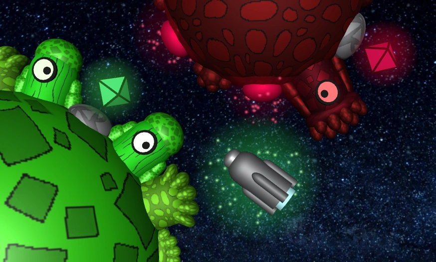 |
| ---------------------------------------------------- |

## Creating an universe

When you download the game, you will be in the main menu. From here you can
create new universe or join a multiplayer server.

| 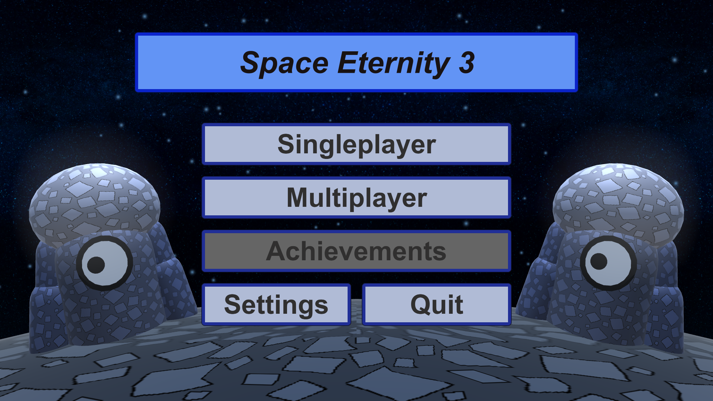 |
| ------------------------------------------- |

We recommend playing singleplayer the first time. Multiplayer needs a server, which you can
download [here](./server). To create the universe, you have to click "create" and "play" button.

| 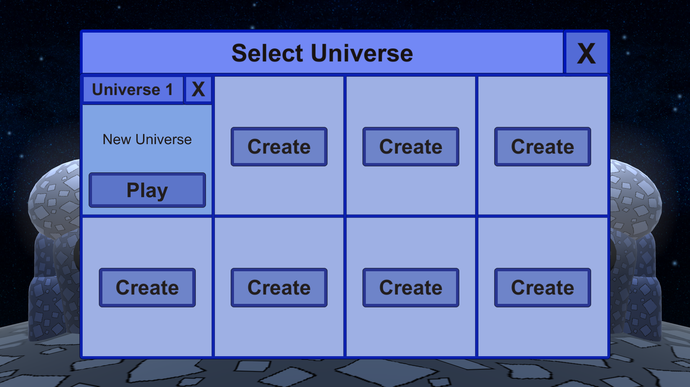 | 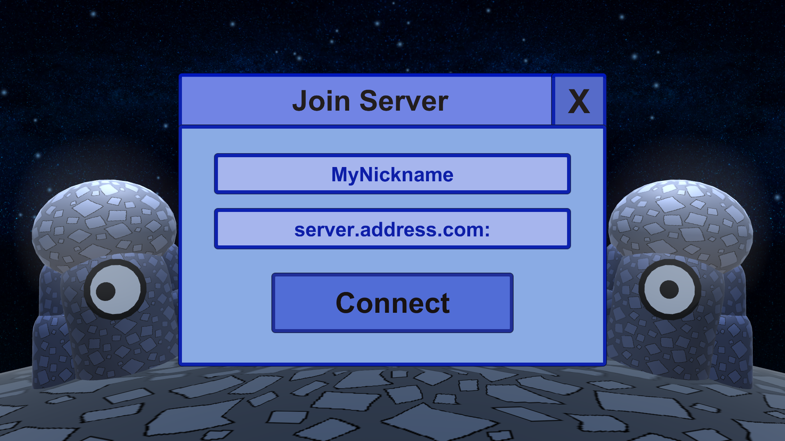 |
| ------------------------------------------- | ------------------------------------------- |

## Engine and items

After joining your first universe you will appear at spawn. This is the center of your procedurally generated world.

|  |
| -------------------------------------------- |

Just hold space or shift (turbo) to activate your engine. You choose your fly direction using your mouse coursor.
Turbo uses turbo bar energy, which regenerates when you don't use it.
You can also break and place items on asteroids using your mouse buttons. Your items will appear in the
inventory bar in the bottom of your screen. You extend and retract your drill by pressing R. By holding LMB you can drill some objects from asteroids.

|  |  |
| -------------------------------------------- | -------------------------------------------- |
|  |  |

## Other controls

| Input         | Action                                       |
| ------------- | -------------------------------------------- |
| Mouse         | Set direction of movement and shooting.      |
| LMB           | Take item or activate drill.                 |
| RMB           | Place / Use item.                            |
| Space         | Use engine.                                  |
| Left Shift    | Use turbo.                                   |
| Left Alt      | Use brake.                                   |
| E             | Open / Close inventory.                      |
| R             | Extend / Retract drill.                      |
| A             | Use artefact.                                |
| Scroll        | Change selected inventory slot.              |
| Ctrl + Scroll | Change camera zoom.                          |
| Ctrl + RMB    | Place special bullets without shooting them. |
| Escape        | Close inventory or open pause menu.          |
| F1            | Hide / Show UI.                              |
| F11           | Enable / Disable full screen mode.           |
| Tab           | Open multiplayer info menu.                  |

## Crafting

When you pick up enough items, you can create other things using crafting. To do that
just press E and look at the left UI segment. You will see a crafting window. You
can choose item categories and when you have enough items for a specified crafting
just click it. You can also hold to craft faster.

| 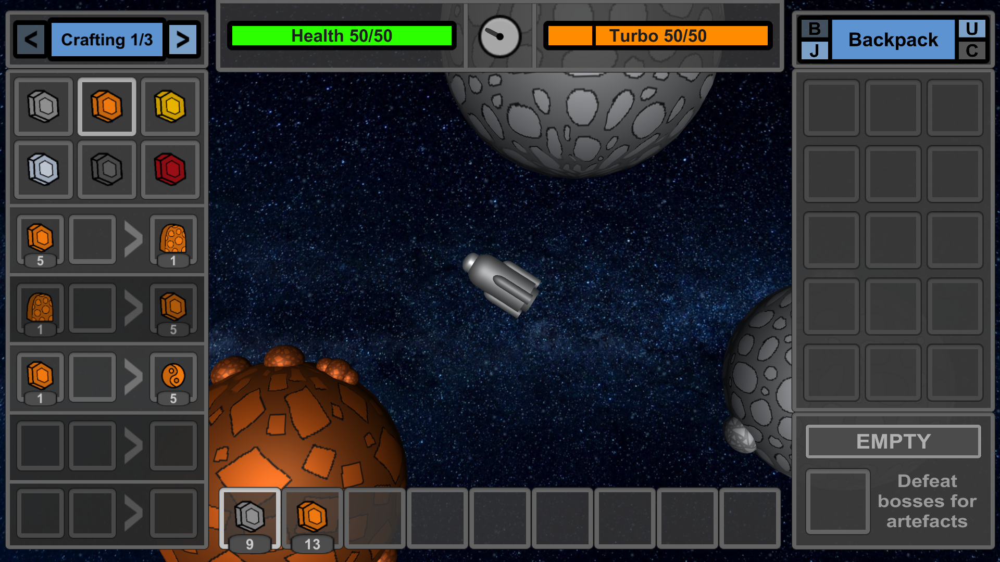 |
| ----------------------------------------------- |

|  | 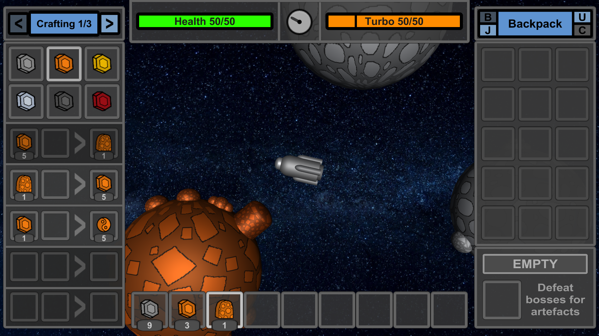 |
| ----------------------------------------------- | ----------------------------------------------- |

## Upgrades

It is possible to find some gold and amethyst. They are a bit rarer than other stones, but
can help you upgrading your spaceship.

| 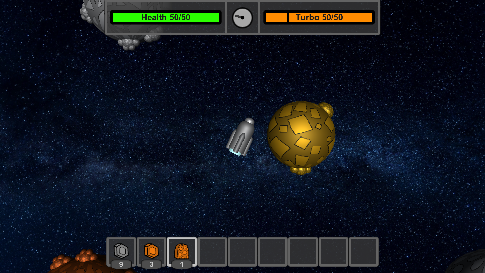 | 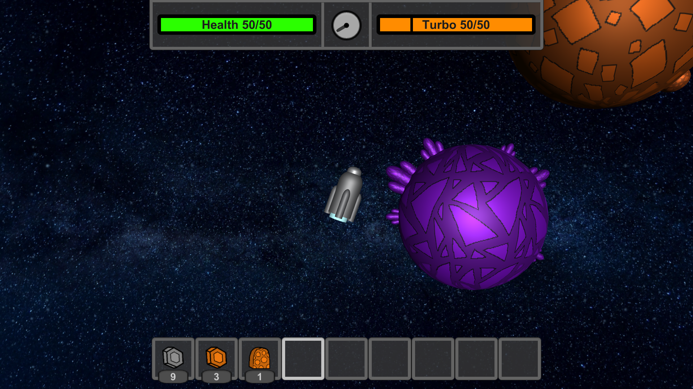 |
| -------------------------------------------- | -------------------------------------------- |

To do that, look at the right UI segment. You will see a backpack window. All your slots are locked
now, but you can unlock them using upgrades. Click the small "U" button. You will see the upgrade window. Just choose the right upgrade and buy it.

|  |
| ----------------------------------------------- |

| 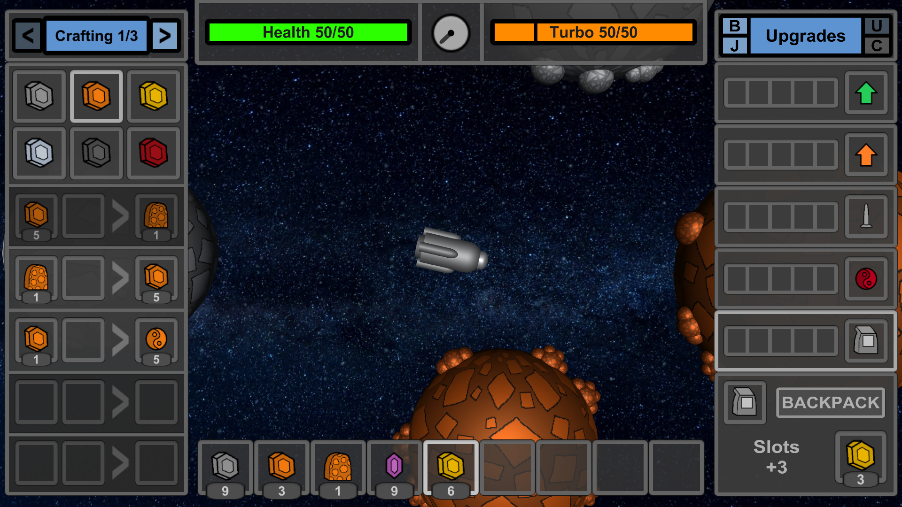 |  |
| ----------------------------------------------- | ----------------------------------------------- |

### All possible upgrades

| Icon | Upgrade  | Description                                       |
| ---- | -------- | ------------------------------------------------- |
|      | Health   | Improves your health by 10% per upgrade           |
|      | Turbo    | Improves your turbo max speed by 8% per upgrade   |
|      | Drill    | Improves your drill efficiency by 15% per upgrade |
|      | Bullets  | Improves your bullet damage by 8% per upgrade     |
|      | Backpack | Unlocks 3 slots in your backpack every upgrade    |

### Upgrade prices

| Level | Price       |
| ----- | ----------- |
| 0     | free        |
| 1     | 3 gold      |
| 2     | 6 gold      |
| 3     | 10 gold     |
| 4     | 12 amethyst |
| 5     | 20 amethyst |

## Backpack

To use your backpack, you can press the small "B" button again in the right UI segment.
When you unlock your first 3 slots you can move some of your items into the backpack.
By clicking the arrow button over a specified slot.

|  |
| ----------------------------------------------- |

| 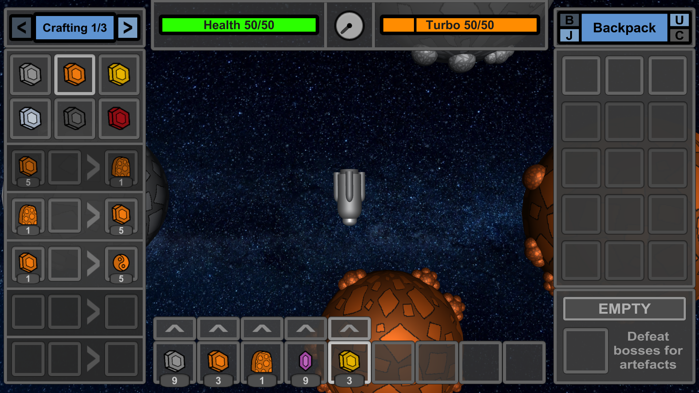 |  |
| ----------------------------------------------- | ----------------------------------------------- |

When you want to get this item back, just click the slot in the backpack.
RMB - moving all items from a slot, LMB - moving only one item.

## Junkyard

When you don't have enough space in your inventory, it must be required to
get rid of some items. Just do not place them on some random asteroids. You can
destroy them using the built-in junkyard. Just press the small "J" button, move
your junk into a special slot and click "discard". After that, you will receive a short humoristic message generated by ChatGPT.

| 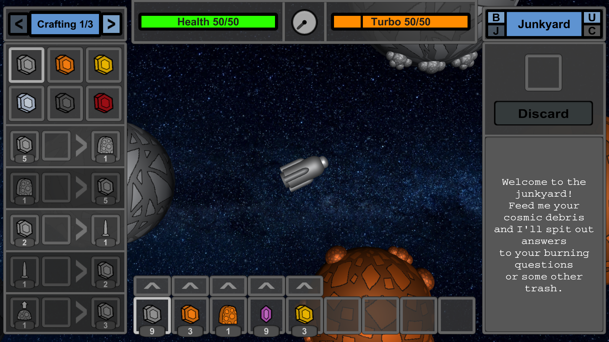 |
| ----------------------------------------------- |

|  | 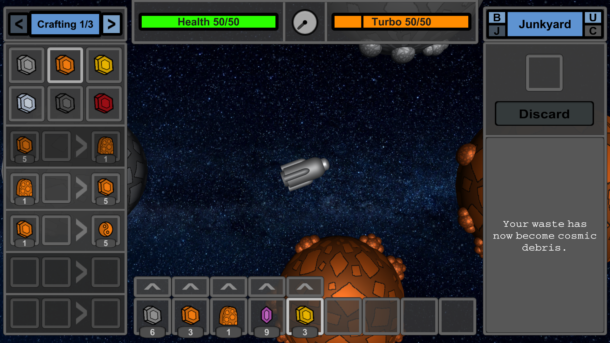 |
| ----------------------------------------------- | ----------------------------------------------- |

## Health

You need to know, that you are not indestructible and you have a limited health.
You get damage by various activities such as crashing into asteroids and boss attacks. It regenerates quite fast,
but when it reaches 0, you will lose all of your items and upgrades and you will be teleported to your respawn point.

|  |  |
| -------------------------------------------- | -------------------------------------------- |

Respawn can be crafted using gold and copper.

|  |  |
| ---------------------------------------------- | ---------------------------------------------- |

## Localizing yourself

There is a compass between bars, which points you to a respawn point. When you click it, it will be replaced with coordinates. These 2 things
will help you know, where you are.

|  |
| --------------------------------------------- |
|  |

## Places to visit

Well, now you know all the basics required for space exploration. There is a lot of things you can find in your universe
and some of them are biomes. Currently, there are 4 biomes and 3 types of structures, one of them having an additional variant.

### Default biome

|  |
| --------------------------------------------------- |

Default biome is the most common and the biggest biome in the entire game. It can be called
a mega biome, because it doesn't have to generate to exist. It's just everywhere, where there is no biomes.
You can find here things like stone, copper, gold, amethyst, grass, coal and magnetic stones.

### Hell biome

|  |
| ------------------------------------------------ |

Hell biomes (8% generation) contains mainly coal and red stones and it's the only place, where you can find diamond asteroid, the
rarest asteroid in the entire game.

### Geyzer biome

|  |
| -------------------------------------------------- |

Geyzer biomes (8% generation) are the only place in the game, where geyzers naturally generate. You can find here stone and
magnetic stones, but also geyzers on the majority of asteroids.

### Alien biome

|  |
| ------------------------------------------------- |

Alien biomes (8% generation) are the natural ecosystem for all good aliens. You can find 2 times
more gold here, than in the default biome and that's one of the reasons, why aliens
decided to settle down here.

### Cementeries

| 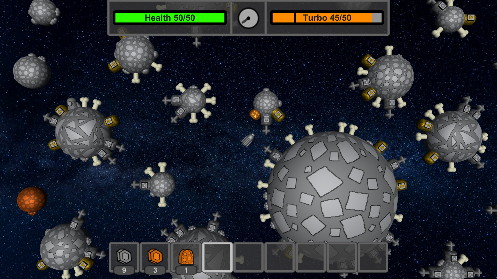 |
| ------------------------------------------------------ |

Cementeries (3% generation) generate less frequently than biomes, but they contain some really
useful items due to treasures, which you can find there. In the middle of a biome,
there is a giant asteroid of size 20, normally impossible to generate. Here is a loottable for every treasure:

| Icon                                           | Item            | Amount | Chance |
| ---------------------------------------------- | --------------- | ------ | ------ |
|    | stone           | 3-6    | 12%    |
|   | bone            | 2-4    | 12,5%  |
|   | small diamond   | 1-3    | 0,5%   |
|   | dead alien      | 1-1    | 10%    |
|    | pumpkin         | 1-1    | 10%    |
|   | unstable matter | 1-2    | 8%     |
|   | power element   | 1-2    | 4%     |
|   | blank element   | 1-2    | 4%     |
|  | healing potion  | 1-2    | 9,5%   |
|  | turbo potion    | 1-2    | 9,5%   |
|    | small amethyst  | 2-6    | 10%    |
|   | gold            | 3-8    | 10%    |

### Stars

|  |
| ------------------------------------------------- |

Stars (1,5% generation) are quite rare, but they offer fire bullets, which
you can duplicate using coal. They are always surrounded by coal asteroids
with fire bullets on them. You can also regenerate immortality artefact with the star wind.
More about artefacts later in this article.

### Arenas

|  |
| --------------------------------------------------- |

Arenas (4% generation) are the most important element of SE3 and they contain
the most powerful items in the entire universe, the artefacts. To get
access to them, you first need to defeat a boss, which protects them.
More about battles in the second next segment.

### Arenas (catastrophic variant)

|  |
| --------------------------------------------------- |

Catastrophic arenas (0.5% generation) are the rarest structure in
the game. No one knows, what happened here, but one thing we know for sure.
That ancient event generated an enormous amount of unstable matter.
The artefact and the boss are both missing.

## Boss fights

Boss fights are the main element of the entire gameplay. You can manage
them using an in-world UI in the center of arena. To summon a boss, you
need 10 amethyst. Just put it into a special bedrock storage and click "battle".

|  |  |
| -------------------------------------------- | -------------------------------------------- |

To get access to the artefact, you need to defeat a boss 3 times. Every battle activation requires 10 amethyst.
Every boss appears in 3 phases: I, II and III. They are marked in the arena UI and as the part of a boss nick.
After defeating boss in one phase, you will upgrade your arena to the next. When you defeat boss in phase III,
you will get access to the artefact. Boss gains more hp every phase and it has access to more types of attacks.
When you are about to die or you can't defeat an activated boss in time, you can always give up. Do
that by pressing "escape" button and clicking "Give Up". The battle will end, but you will lose your amethyst.

|  |
| -------------------------------------------- |

To defeat a boss, you need a way to deal damage. You can do that with bullets. There are currently 5 types of bullets
available for player use. Damage presented in the table can be improved through upgrades.

| Bullet   | Icon                                          | DPS       | Bullet cooldown | Bullet speed | Description                                                                                           |
| -------- | --------------------------------------------- | --------- | --------------- | ------------ | ----------------------------------------------------------------------------------------------------- |
| Coal     |  | 14.29     | 0.14s           | 0.45         | A weaker bullet, made of coal, mainly for fire bullet production.                                     |
| Copper   |  | 21.43     | 0.14s           | 0.45         | A default bullet, made of copper.                                                                     |
| Red      |  | 28.57     | 0.14s           | 0.45         | A stronger bullet, made of red stone.                                                                 |
| Fire     |  | 28.57\*   | 0.21s           | 0.4          | A bullet, which sets players on fire. Starandus is immune to it.                                      |
| Unstable |  | 35.71\*\* | 0.28s           | 0.35         | The strongest, but the rarest bullet. Degenrator and players with unstable artefact are immune to it. |

\* Fire bullets deal 14.29 DPS to players, but they set them on fire dealing 2 dmg every second. Fire bullet gives that effect for 2 cycles.  
\*\* Unstable bullets deal 28.57 DPS to players. It will change in Beta 2.1.

## Bosses

There are 5 types of bosses. Every one of them drops a different artefact.
Every boss has 5 attack states. One of them is a default state. Two next are unlocked
in phase I. When boss enters a new phase, it unlocks a new attack state.
Here is a list of all bosses and their mechanics:

### Protector

| 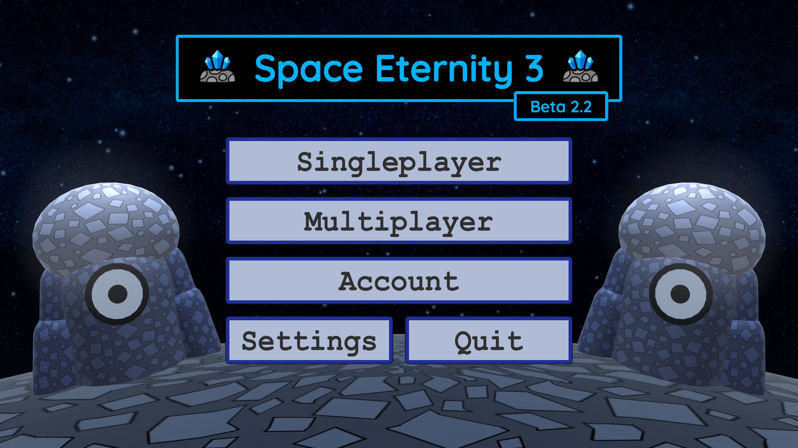 |
| --------------------------------------- |

| Protector speed: NORMAL |
| ----------------------- |

| Attack ID | Name     | Description                                                        | Preview                                 |
| --------- | -------- | ------------------------------------------------------------------ | --------------------------------------- |
| 0         | -        | Protector shoots copper bullets. It aims.                          |  |
| 1         | Electron | Protector shoots one electron. It aims.                            |  |
| 2         | Shield   | Protector activates a shield, which makes it immune to all damage. |  |
| 3         | Rockets  | Protector sends two kamikadze rockets to chase the player.         |  |
| 4         | Ufoquake | Protector moves and shoots faster.                                 |  |

### Adecodron

|  |
| --------------------------------------- |

| Adecodron speed: VERY FAST |
| -------------------------- |

| Attack ID | Name       | Description                                                                | Preview                                 |
| --------- | ---------- | -------------------------------------------------------------------------- | --------------------------------------- |
| 0         | -          | Adecodron doesn't shoot anything. It attacks you using spikes on its body. |  |
| 1         | Spikes     | Adecodron shots a circle of poisoned spikes.                               |  |
| 2         | Guns       | Adecodron activates its guns, which shoot red bullets. It aims.            |  |
| 3         | Spikeballs | Adecodron sends four poisoned spikeballs to chase the player.              |  |
| 4         | Adecoquake | Adecodron moves faster.                                                    |  |

### Octogone

|  |
| --------------------------------------- |

| Octogone speed: FAST |
| -------------------- |

| Attack ID | Name          | Description                                                                                                       | Preview                                 |
| --------- | ------------- | ----------------------------------------------------------------------------------------------------------------- | --------------------------------------- |
| 0         | -             | Octogone shoots brainwaves and pushes you with its tentacles. It aims.                                            |  |
| 1         | Thinking      | Octogone sends a lot of brainwave bullets in all directions.                                                      |  |
| 2         | Stickybulb    | Octogone shoots one stickybulb, which can slow down a target for some time and prevent it from shooting. It aims. |  |
| 3         | Teleportation | Octogone teleports randomly.                                                                                      |  |
| 4         | Octoquake     | Octogone moves and shoots faster. It creates virtual spikes on its body, which deal damage same as Adecodron's.   |  |

### Starandus

|  |
| --------------------------------------- |

| Starandus speed: SLOW |
| --------------------- |

| Attack ID | Name       | Description                                                                                                                            | Preview                                 |
| --------- | ---------- | -------------------------------------------------------------------------------------------------------------------------------------- | --------------------------------------- |
| 0         | -          | Starandus shoots fire bullets. It aims.                                                                                                |  |
| 1         | Geyzers    | Starandus activates its fire geyzers, which deal damage, push players and set them on fire.                                            |  |
| 2         | Supernova  | Starandus sends a lot of fire bullets in all directions. It creates a small fire-geyzer-type collider without attached pushing script. |  |
| 3         | Graviting  | Starandus sends a lot of gravitons in all directions, which pull the player towards the boss.                                          |  |
| 4         | Neutroning | Starandus starts sending neutronium bullets and activates safe blue geyzers.                                                           |  |

### Degenerator

|  |
| --------------------------------------- |

| Degenerator speed: NORMAL |
| ------------------------- |

| Attack ID | Name       | Description                                                                                    | Preview                                 |
| --------- | ---------- | ---------------------------------------------------------------------------------------------- | --------------------------------------- |
| 0         | -          | Degenerator shoots red and unstable bullets. It aims.                                          |  |
| 1         | Rockets    | Degenerator sends two kamikadze rockets to chase the player.                                   |  |
| 2         | Degeshield | Degenerator tries to make a shield, but it ends up shooting unstable matter in all directions. |  |
| 3         | Remote     | Degenerator attacks you with a laser impossible to dodge.                                      |  |
| 4         | Degequake  | Degenerator moves and shoots faster. It sometimes has unstable pulses.                         |  |

## Artefacts

Artefacts are the most powerful items in the universe. They give you
some special powers, when you wear them. You can obtain them by defeating bosses.
Every boss gives you a specified artefact. After defeating boss in phase III, there
will appear an asteroid with the artefact instead of battle menu in the center of arena.
You can pick it up like other items and then move it to a special artefact slot using button "SET" instead of "^".

|  |  |
| ----------------------------------------------- | ----------------------------------------------- |
|  |          |

| Icon                                          | Artefact    | Boss        | Description                                                                                                                                          |
| --------------------------------------------- | ----------- | ----------- | ---------------------------------------------------------------------------------------------------------------------------------------------------- |
|  | Protection  | Protector   | The super health bar upgrade. It improves your health by 25%, speeds up health regeneration by 1.5 and reduces health regeneration cooldown by half. |
|  | Impulse     | Adecodron   | Allows you to make impulses, when you have enough power. You can use it for attack, defense or just for fun.                                         |
|  | Illusion    | Octogone    | Allows you to become invisible to bosses and other players.                                                                                          |
|  | Immortality | Starandus   | When you wear it and die, you won't die, but your artefact will turn gray. Recharge it using a star wind.                                            |
|  | Unstable    | Degenerator | That's a mystery. All ancient notes were lost. Figure it out by yourself.                                                                            |

## Datapacks

Mark, please, write a tutorial how to edit and load datapacks on client and server side.

## Contact

Join our [discord server](https://discord.gg/e4ppBTRKhg).  
Found some bugs? Contact with the game developer: kamiloso.skoposo@gmail.com.
