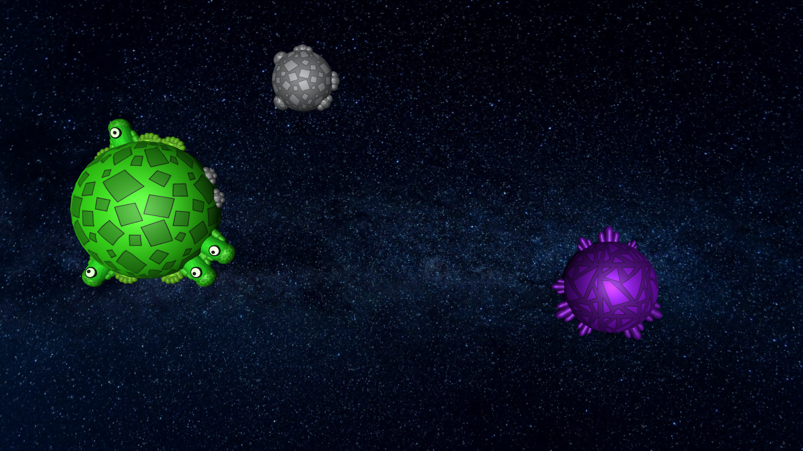
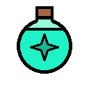
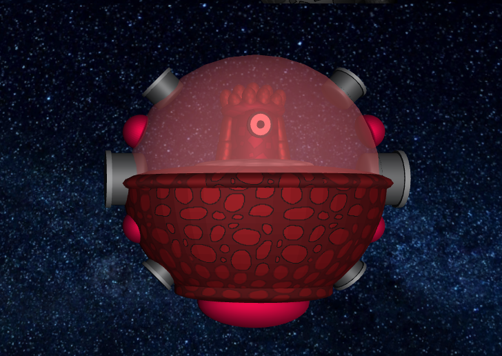
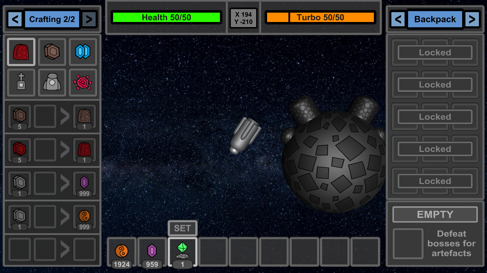

# How to play

You should read this tutorial before starting your gameplay. You will learn
how to play, what you can find in the universe and how to use it properly.  

This tutorial was created for version: `Beta 2.2`

|  |
| ---------------------------------------------- |

## Basics

After joining your first universe you will appear at spawn. This is the center of your procedurally generated world and
the default respawn point.

|  |
| -------------------------------------------- |

Hold space, left shift (turbo) or left alt (brake) to activate your engine. The spaceship will always rotate towards your cursor.

|  |  |
| -------------------------------------------- | -------------------------------------------- |

You can obtain items by picking them up or by drilling in asteroids.
Items are collected using LMB and placed using RMB. You can extend/retract your drill by pressing `R`.

|  |  |
| -------------------------------------------- | -------------------------------------------- |

## Controls

Here is the list of all controls in the game:

| Input         | Action                                       |
| ------------- | -------------------------------------------- |
| Mouse         | Set direction of movement and shooting.      |
| LMB           | Break item or use extended drill.            |
| RMB           | Place / Use item.                            |
| Space         | Use engine.                                  |
| Left Shift    | Use turbo.                                   |
| Left Alt      | Use brake.                                   |
| R             | Extend / Retract drill.                      |
| A             | Use artefact.                                |
| E             | Open / Close inventory.                      |
| Scroll        | Change selected inventory slot.              |
| Ctrl + Scroll | Change camera zoom.                          |
| Ctrl + RMB    | Place special bullets without shooting them. |
| Escape        | Close inventory or open pause menu.          |
| T or /        | Open chat field.                             |
| Tab (hold)    | Open multiplayer info menu.                  |
| F1            | Hide / Show UI.                              |
| F2            | Hide all chat messages.                      |
| F11           | Enable / Disable full screen mode.           |

## Crafting

Crafting can be opened by pressing `E`. All available recipes are present in the left UI segment.

|  |
| ----------------------------------------------- |

## Upgrades

Upgrades can be found in the right UI segment along with [backpack](#backpack) and [junkyard](#junkyard).
They allow you to make your spaceship better and stronger.

|  |
| ----------------------------------------------- |

| Aspect   | Description                                   |
| -------- | --------------------------------------------- |
| Health   | Improves health by 10% per upgrade.           |
| Turbo    | Improves turbo max speed by 8% per upgrade.   |
| Drill    | Improves drill efficiency by 12% per upgrade. |
| Bullets  | Improves bullet damage by 8% per upgrade.     |
| Backpack | Unlocks 3 backpack slots every upgrade.       |

Every feature can be upgraded up to 5 times. The first upgrade costs 5 gold,
then 10, 15, 20 and 25.

## Backpack

Backpack is present in the right UI segment. To unlock it, at least one backpack [upgrade](#upgrades) is needed.
Backpack contains the [artefact](#artefacts) slot too, which is always unlocked.

|  |
| ----------------------------------------------- |

To insert item into backpack press the `^` button over the item slot.
- RMB - to move all items
- LMB - to move only one item

When you want to get the item back, click the slot in the backpack.

## Junkyard

You can discard items using junkyard. It can be found in the right UI segment.
The discard slot works pretty much like slots in [backpack](#backpack), but after
pressing discard button, all contained items will be removed.

|  |
| ----------------------------------------------- |

## Health

You can see your health bar in the upper UI segment. When you lose health, it will regenerate quite fast,
but you can use some [potions](#potions) to regain part of it instantly.

|  |  |
| -------------------------------------------- | -------------------------------------------- |

Exploding will result in losing all of your items and upgrades. It can be prevented by having keep inventory
enabled or playing more carefully.

## Respawn

The respawn point can be set using respawn item craftable from copper and gold.

|  |  |
| ---------------------------------------------- | ---------------------------------------------- |

## Storages

If you want to store your treasures in a safe location, you can craft and place a storage.
Using LMB and RMB you will be able to transfer items between storage and your inventory.

|  |
| ---------------------------------------------- |

## Bullets

Bullets are commonly used to deal damage. There are currently 5 types of them
available for player use. Damage presented in the table can be increased through [upgrades](#upgrades).

| Name     | Icon                                           | Damage | Cooldown | Speed | DPS     | Description                                                                                              |
| -------- | ---------------------------------------------- | ------ | -------- | ----- | ------- | -------------------------------------------------------------------------------------------------------- |
| Copper   |   | 3      | 0.14s    | 0.45  | 21.42   | A default bullet made of copper.                                                                         |
| Red      |   | 4      | 0.14s    | 0.45  | 28.57   | A stronger bullet made of red stone.                                                                     |
| Wind     |  | 3      | 0.20s    | 0.60  | 15.00   | A bullet, which pushes enemies away.                                                                     |
| Fire     |   | 3      | 0.20s    | 0.40  | 15.00\* | A bullet, which sets enemies on fire. Starandus is immune to it.                                         |
| Unstable |   | 10     | 0.28s    | 0.40  | 35,71   | The strongest, but the rarest bullet. Degenrator and players wearing unstable artefact are immune to it. |

\* Fire bullets set enemies on fire, which deals additional damage.

## Potions

Potions can give you some very useful effects. They can be obtained by combining common materials with
magic ingredients in [crafting](#crafting), but this is also possible to get them from treasures. See all of them
in the table below:

| Potion  | Icon                                           | Description                                                                                                           |
| ------- | ---------------------------------------------- | --------------------------------------------------------------------------------------------------------------------- |
| Healing |  | Adds 20 hp to your health bar.                                                                                        |
| Turbo   |  | Refills your turbo bar.                                                                                               |
| Power   |  | Refills your power bar. Only available when wearing impulse, illusion or unstable artefact.                           |
| Blank   |  | Adds 15 hp to your health bar and removes effects like fire, poison or stickybulb.                                    |
| Killing |  | Removes 15 hp from your health bar. If you're wearing unstable artefact, it will also add 10 power to your power bar. |
| Max     |  | Refills all your bars and removes effect. Only obtainable from dark cementeries.                                      |
| Shield  |  | Coming soon!                                                                                                          |

## Navigation

The universe in SE3 is procedurally generated, which means that it feels infinite.
There are some features that can help you know where you are. A compass between the health
and turbo bar points you to a respawn point. When you click it, it will display coordinates.

|  |
| --------------------------------------------- |
|  |

## Locations

In the SE3 universe you can find various biomes and structures:

| ID  | Location           | Chance | Preview                                                 | Description                                                 |
| --- | ------------------ | ------ | ------------------------------------------------------- | ----------------------------------------------------------- |
| 0   | Default Biome      | -      |      | The default universe generation.                            |
| 1   | Hell Biome         | 8%     |         | The hellish biome with coal and evil aliens everywhere.     |
| 2   | Geyzer Biome       | 8%     |       | The windy biome really hard to navigate through.            |
| 3   | Alien Biome        | 8%     |        | The fascinating location full of friendly aliens.           |
| 4   | Arena              | 4%     |      | A place, where you can fight a boss and get the artefact.   |
| 5   | Catastrophic Arena | 0.4%   |      | Well, it should probably remain a mystery.                  |
| 6   | Cementery          | 2.7%   |  | Aliens are buried here along with their treasures.          |
| 7   | Dark Cementery     | 1.3%   |  | The more hellish cementery variant.                         |
| 8   | Star               | 1.5%   |        | The mysterious source of heat and power.                    |
| 9   | Copper Facilities  | 0%     | Image not available yet                                 | Coming soon!                                                |

## Boss fights

To summon a boss, put 10 amethyst into a special bedrock storage in the center of any arena and click `BATTLE`.
You need to dodge boss attacks and attack it with your own bullets.

|  |  |
| -------------------------------------------- | -------------------------------------------- |

If for some reason you want to
stop the battle, you can resign by pressing `escape` and clicking button `Give Up`. However, this way you will
waste your amethyst.

|  |
| -------------------------------------------- |

After defeating a boss three times (boss becomes harder every time you defeat it),
you will be granted with one [artefact](#artefacts), which
you can wear and get some special powers. There are currently 5 types of bosses.
Every one of them is presented in the table below.

| ID  | Boss        | Image                                       | Description                                                                                                                                   |
| --- | ----------- | ------------------------------------------- | --------------------------------------------------------------------------------------------------------------------------------------------- |
| 1   | Protector   |  | There are gosspis, that it is Protector, which is regularly seen on Earth. Anyway, it's just a regular UFO, nothing too spectacular... right? |
| 2   | Adecodron   |  | It's neither the machine, nor the alien, but it's certainly very dangerous with its spikes, poisonous attacks and the very high speed.        |
| 3   | Octogone    |  | The giant octopus-like monster from the other dimension. However, this creature really dislikes being called a space octopus.           |
| 4   | Starandus   |  | The machine so advanced, that it was able to compress a star and use the nuclear fusion as the unlimited source of power.                     |
| 6   | Degenerator |  | It is said, that Degenerator is actually the evil version of Protector, but nobody knows how it exactly became such.                          |

## Artefacts

Artefacts give you some special powers when you wear them.
Every boss drops a specific one after it is defeated three times.
You can pick up the artefact and move it into a special slot using button `SET`.

|  |  |
| ----------------------------------------------- | ----------------------------------------------- |
|  |  |

| Icon                                          | Artefact    | Boss        | Description                                                                                                                                          |
| --------------------------------------------- | ----------- | ----------- | ---------------------------------------------------------------------------------------------------------------------------------------------------- |
|  | Protection  | Protector   | The super health bar upgrade. It improves your health by 25%, speeds up health regeneration by 50% and reduces health regeneration cooldown by half. |
|  | Impulse     | Adecodron   | Allows you to make impulses, when you have enough power. You can use it for attack, defense or just for fun.                                         |
|  | Illusion    | Octogone    | Allows you to become invisible to bosses and other players. It makes you 20% faster and immune to crash damage when active.                          |
|  | Immortality | Starandus   | When you wear it and die, you won't die, but your artefact will turn gray. Recharge it by exposing it to star wind.                                  |
|  | Unstable    | Degenerator | That's a mystery. All ancient notes were lost. Figure it out by yourself, but do not kill anyone by accident.                                        |
