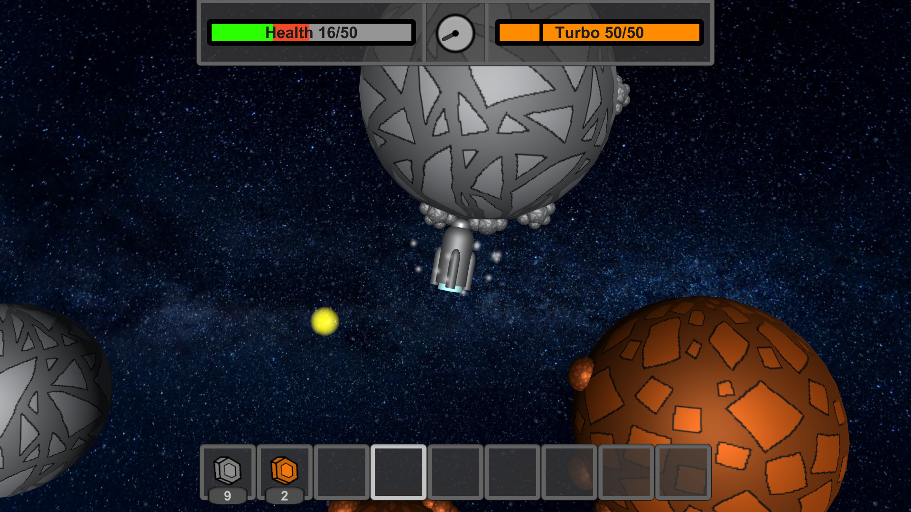
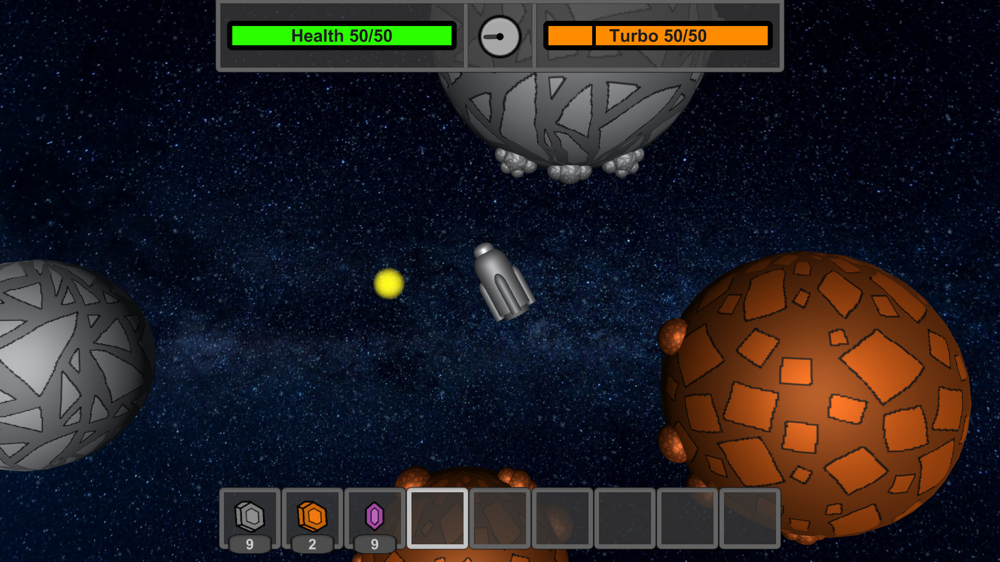
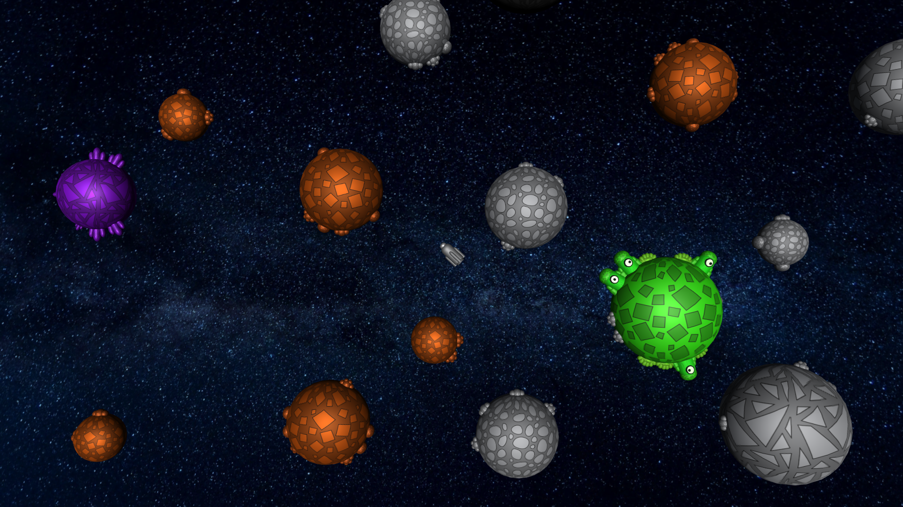
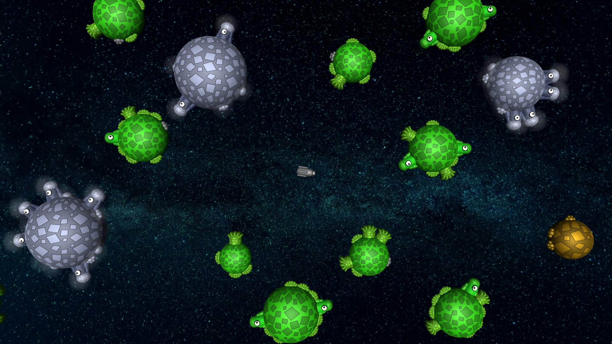
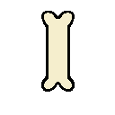
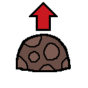
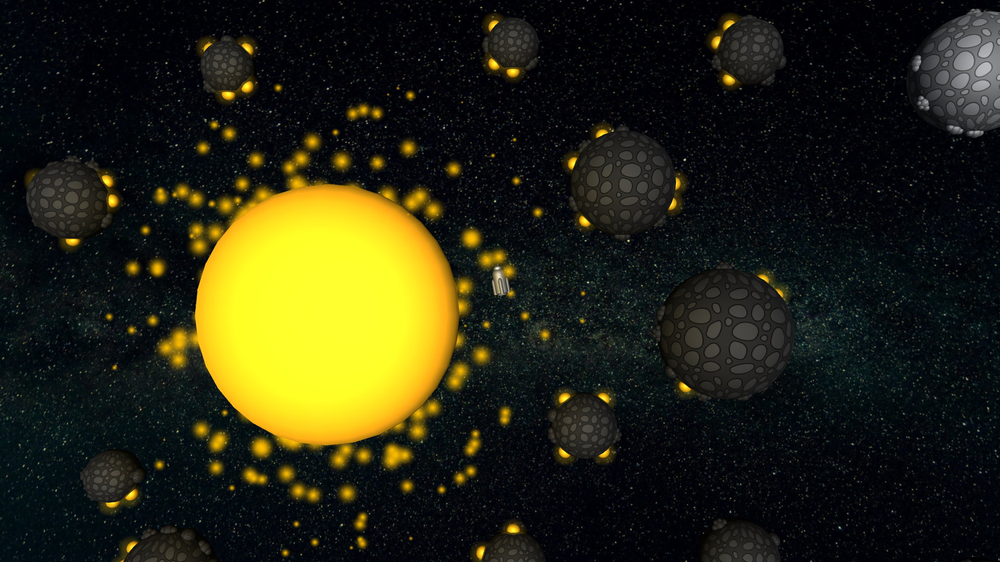

# How to play

Space Eternity 3 is a PC game created by Kamiloso in Unity. Visit our universe and explore
the infinite area full of amazing places and challenges!

|  |
| ---------------------------------------------------- |

If you want to learn how to play, read this tutorial:

## All controls

| Input         | Action                                       |
| ------------- | -------------------------------------------- |
| Mouse         | Set direction of movement and shooting.      |
| LMB           | Take item or activate drill.                 |
| RMB           | Place / Use item.                            |
| Space         | Use engine.                                  |
| Left Shift    | Use turbo.                                   |
| Left Alt      | Use brake.                                   |
| E             | Open / Close inventory.                      |
| R             | Extend / Retract drill.                      |
| A             | Use artefact.                                |
| Scroll        | Change selected inventory slot.              |
| Ctrl + Scroll | Change camera zoom.                          |
| Ctrl + RMB    | Place special bullets without shooting them. |
| Escape        | Close inventory or open pause menu.          |
| F1            | Hide / Show UI.                              |
| F11           | Enable / Disable full screen mode.           |
| Tab           | Open multiplayer info menu.                  |

## Creating an universe

When you download the game, you will be in the main menu. From here you can
create a new universe or join a multiplayer server.

|  |
| ------------------------------------------- |

We recommend playing singleplayer the first time. Multiplayer needs a server, which you can
download [here](./server). To create the universe, you have to click "create" and "play" button.

|  |  |
| ------------------------------------------- | ------------------------------------------- |

## Engine and items

After joining your first universe you will appear at spawn. This is the center of your procedurally generated world.

|  |
| -------------------------------------------- |

Hold space or shift (turbo) to activate your engine. You choose fly direction using your mouse cursor.

|  |  |
| -------------------------------------------- | -------------------------------------------- |

You can obtain items by picking them up or by drilling them from asteroids. (press R to extend a drill)

|  |  |
| -------------------------------------------- | -------------------------------------------- |

## Crafting

You can open crafting by pressing E. All recipes will appear in the left UI segment.

|  |
| ----------------------------------------------- |

|  |  |
| ----------------------------------------------- | ----------------------------------------------- |

## Upgrades

Gold and amethyst can be used to upgrade your spaceship.

|  |  |
| -------------------------------------------- | -------------------------------------------- |

To open upgrade window, press E and look at the right UI segment. Upgrades are in the 'U' category.

|  |
| ----------------------------------------------- |

|  |  |
| ----------------------------------------------- | ----------------------------------------------- |

### All possible upgrades

| Upgrade  | Description                                       |
| -------- | ------------------------------------------------- |
| Health   | Improves your health by 10% per upgrade           |
| Turbo    | Improves your turbo max speed by 8% per upgrade   |
| Drill    | Improves your drill efficiency by 15% per upgrade |
| Bullets  | Improves your bullet damage by 8% per upgrade     |
| Backpack | Unlocks 3 slots in your backpack every upgrade    |

### Upgrade prices

| Level | Price       |
| ----- | ----------- |
| 0     | free        |
| 1     | 3 gold      |
| 2     | 6 gold      |
| 3     | 10 gold     |
| 4     | 12 amethyst |
| 5     | 20 amethyst |

## Backpack

To open backpack window, press E and look at the right UI segment. Backpack is in the 'B' category.
You can unlock your slots by upgrading backpack in the upgrade window.

|  |
| ----------------------------------------------- |

To insert item into a backpack, press the '^' button over an item slot.
- RMB - to move all items
- LMB - to move only one item

|  |  |
| ----------------------------------------------- | ----------------------------------------------- |

When you want to get this item back, just click the slot in the backpack.

## Junkyard

You can discard some items using junkyard. It's in the 'J' category of the right UI segment.
After doing so, you will receive a short humoristic message generated by ChatGPT.

|  |
| ----------------------------------------------- |

|  |  |
| ----------------------------------------------- | ----------------------------------------------- |

## Health

You have a health bar, which you can see in the upper UI segment.
You get damage from various activities such as crashing into asteroids and boss attacks. Your health regenerates quite fast,
but when it reaches 0, your spaceship will explode and you will lose everything. Then you will respawn.

|  |  |
| -------------------------------------------- | -------------------------------------------- |

Respawn can be crafted using gold and copper.

|  |  |
| ---------------------------------------------- | ---------------------------------------------- |

## Localizing yourself

There is a compass between bars, which points you to a respawn point. When you click it, it will be replaced with coordinates. These 2 things
will help you know, where you are.

|  |
| --------------------------------------------- |
|  |

## Places to visit

It's time to explore! In the SE3 universe you can find various biomes and structures, which are described below.

### Default biome

|  |
| --------------------------------------------------- |

Default biome is the most common biome.
It contains stone, copper, gold, amethyst, grass, coal and magnetic stones.

### Hell biome

|  |
| ------------------------------------------------ |

| Rarity: (8%) |
|---|

Hell biomes contain mainly coal and red stones. It's the only place, where you can find a diamond asteroid.

### Geyzer biome

|  |
| -------------------------------------------------- |

| Rarity: (8%) |
|---|

Geyzer biomes consist mainly of normal and magnetic stone. You can find geyzers there.

### Alien biome

|  |
| ------------------------------------------------- |

| Rarity: (8%) |
|---|

Alien biomes contain mainly good-alien asteroids (grass, magnetic). You can find 2 times more gold there.

### Cementeries

|  |
| ------------------------------------------------------ |

| Rarity: (2%) |
|---|

Cementeries contain treasures with some really useful items. Here is a loottable for every treasure:

| Icon                                           | Item            | Amount | Chance |
| ---------------------------------------------- | --------------- | ------ | ------ |
|    | stone           | 3-6    | 12,5%  |
|    | pumpkin         | 1      | 12,5%  |
|   | bone            | 2-4    | 12,5%  |
|   | dead alien      | 1      | 12,5%  |
|   | unstable matter | 1-2    | 6%     |
|  | healing potion  | 1-2    | 12%    |
|  | turbo potion    | 1-2    | 12%    |
|   | gold            | 3-7    | 10%    |
|    | small amethyst  | 3-7    | 10%    |

### Cementeries (dark variant)

|  |
| ------------------------------------------------------- |

| Rarity: (1%) |
|---|

Dark cementeries are a rarer and more powerful cementery variant. Treasures
here contain a bit different and in some cases better loot:

| Icon                                           | Item            | Amount | Chance |
| ---------------------------------------------- | --------------- | ------ | ------ |
|   | dark stone      | 3-6    | 12%    |
|   | lava geyzer     | 1      | 12%    |
|   | bone            | 2-4    | 12%    |
|   | dead alien      | 1      | 12%    |
|   | small diamond   | 1-3    | 1,5%   |
|   | unstable matter | 1-3    | 8,5%   |
|  | blank potion    | 1-2    | 10%    |
|  | power potion    | 1-2    | 10%    |
|  | max potion      | 1      | 4%     |
|   | gold            | 2-6    | 11%    |
|    | small amethyst  | 3-7    | 7%     |

### Stars

|  |
| ------------------------------------------------- |

| Rarity: (1.5%) |
|---|

There are always coal asteroids around stars
with fire bullets on them. You can duplicate this resource using coal.
It is possible regenerate immortality artefact with the star wind.
More about artefacts later in this article.

### Arenas

|  |
| --------------------------------------------------- |

| Rarity: (4%) |
|---|

Arenas contain bosses, which you can defeat and obtain one of 5 powerful artefacts.
More about battles in the second next segment.

### Arenas (catastrophic variant)

|  |
| --------------------------------------------------- |

| Rarity: (0.5%) |
|---|

Rare arena variant without boss and artefact. It contains a lot of unstable matter.

## Boss fights

Boss fights are the main element of the entire gameplay. You can manage
them using an in-world UI in the center of the arena. To summon a boss, you
need 10 amethyst. Put it into a special bedrock storage and click "battle".

|  |  |
| -------------------------------------------- | -------------------------------------------- |

To get access to the artefact, you need to defeat a boss 3 times. Every battle activation requires 10 amethyst.
Every boss appears in 3 phases: I, II and III. They are marked in the arena UI and as the part of a boss nick.
After defeating boss in one phase, you will upgrade your arena to the next. When you defeat boss in phase III,
you will get access to the artefact. Boss gains more hp every phase and it has access to more types of attacks.
When you are about to die or you can't defeat an activated boss in time, you can always give up. Do
that by pressing "escape" button and clicking "Give Up". The battle will end, but you will lose your amethyst.

|  |
| -------------------------------------------- |

## Bullets

Bullets are used to deal damage. There are currently 5 types of them
available for player use. Damage presented in the table can be increased through upgrades.

| Bullet   | Icon                                          | DPS     | Bullet cooldown | Bullet speed | Description                                                                                           |
| -------- | --------------------------------------------- | ------- | --------------- | ------------ | ----------------------------------------------------------------------------------------------------- |
| Coal     |  | 14.29   | 0.14s           | 0.45         | A weaker bullet, made of coal, mainly for fire bullet production.                                     |
| Copper   |  | 21.43   | 0.14s           | 0.45         | A default bullet, made of copper.                                                                     |
| Red      |  | 28.57   | 0.14s           | 0.45         | A stronger bullet, made of red stone.                                                                 |
| Fire     |  | 23.86\* | 0.22s           | 0.40         | A bullet, which sets players on fire. Starandus is immune to it.                                      |
| Unstable |  | 35.71   | 0.28s           | 0.35         | The strongest, but the rarest bullet. Degenrator and players with unstable artefact are immune to it. |

\* Fire bullet deals 18.18 DPS to players, but they set them on fire dealing 2 dmg every second. Fire bullet gives that effect for 2 cycles.

## Potions

There are currently 6 types of potions available. They give you some very useful effects. You can obtain them by combining common materials
with magic ingredients in crafting or by getting them from cementery treasures. You can use your potion by clicking RMB on a screen when
holding it. If you can't use a potion because of no future effect there will appear text "Potion blocked" so that you won't waste it.
Here is the list of all potions and their properties:

| Potion  | Icon                                           | Description                                                                                                           |
| ------- | ---------------------------------------------- | --------------------------------------------------------------------------------------------------------------------- |
| Healing |  | Adds 20 hp to your health bar.                                                                                        |
| Turbo   |  | Refills your turbo bar.                                                                                               |
| Power   |  | Refills your power bar. Only available when wearing impulse, illusion or unstable artefact.                           |
| Blank   |  | Adds 15 hp to your health bar. Removes effect like fire, poison or stickybulb.                                        |
| Killing |  | Removes 15 hp from your health bar. If you're wearing unstable artefact, it will also add 10 power to your power bar. |
| Max     |  | Refills your health, turbo and power bars and removes effect. The only potion that can't be crafted.                  |

## Bosses

There are 5 types of bosses. Every one of them drops a different artefact.
Every boss has 5 attack states. One of them is a default state. Two next are unlocked
in phase I. When boss enters a new phase, it unlocks a new attack state.
Here is a list of all bosses and their mechanics:

### Protector

|  |
| ------------------------------------------- |

| Protector speed: NORMAL |
| ----------------------- |

| Attack ID | Name     | Description                                                        |
| --------- | -------- | ------------------------------------------------------------------ |
| 0         | -        | Protector shoots copper bullets.                                   |
| 1         | Electron | Protector shoots one electron.                                     |
| 2         | Shield   | Protector activates a shield, which makes it immune to all damage. |
| 3         | Rockets  | Protector sends two kamikadze rockets to chase the player.         |
| 4         | Ufoquake | Protector moves and shoots faster.                                 |

### Adecodron

|  |
| ------------------------------------------- |

| Adecodron speed: VERY FAST |
| -------------------------- |

| Attack ID | Name       | Description                                                                |
| --------- | ---------- | -------------------------------------------------------------------------- |
| 0         | -          | Adecodron flies around and attacks you using spikes on its body.           |
| 1         | Spikes     | Adecodron creates a circle of poisoned spikes.                             |
| 2         | Guns       | Adecodron activates its guns, which shoot red bullets.                     |
| 3         | Spikeballs | Adecodron sends four poisoned spikeballs to chase the player.              |
| 4         | Adecoquake | Adecodron moves faster.                                                    |

### Octogone

|  |
| ------------------------------------------- |

| Octogone speed: FAST |
| -------------------- |

| Attack ID | Name          | Description                                                                                                       |
| --------- | ------------- | ----------------------------------------------------------------------------------------------------------------- |
| 0         | -             | Octogone shoots brainwaves and pushes you with its tentacles.                                                     |
| 1         | Thinking      | Octogone sends a lot of brainwave bullets in all directions.                                                      |
| 2         | Stickybulb    | Octogone shoots one stickybulb, which can slow down a target for some time and prevent it from shooting.          |
| 3         | Teleportation | Octogone teleports randomly.                                                                                      |
| 4         | Octoquake     | Octogone moves and shoots faster. It creates invisible spikes on its body, which deal damage same as Adecodron's. |

### Starandus

|  |
| ------------------------------------------- |

| Starandus speed: SLOW |
| --------------------- |

| Attack ID | Name       | Description                                                                                                                            |
| --------- | ---------- | -------------------------------------------------------------------------------------------------------------------------------------- |
| 0         | -          | Starandus shoots fire bullets.                                                                                                         |
| 1         | Geyzers    | Starandus activates its fire geyzers, which deal damage, push players and set them on fire.                                            |
| 2         | Supernova  | Starandus sends a lot of fire bullets in all directions. It creates a small fire-geyzer-type collider without attached pushing script. |
| 3         | Graviting  | Starandus sends a lot of gravitons in all directions, which pull the player towards the boss.                                          |
| 4         | Neutroning | Starandus starts sending neutronium bullets and activates safe blue geyzers.                                                           |

### Degenerator

|  |
| ------------------------------------------- |

| Degenerator speed: NORMAL |
| ------------------------- |

| Attack ID | Name       | Description                                                                                    |
| --------- | ---------- | ---------------------------------------------------------------------------------------------- |
| 0         | -          | Degenerator shoots red and unstable bullets.                                                   |
| 1         | Rockets    | Degenerator sends two kamikadze rockets to chase the player.                                   |
| 2         | Degeshield | Degenerator tries to make a shield, but it ends up shooting unstable matter in all directions. |
| 3         | Remote     | Degenerator attacks you with a laser impossible to dodge.                                      |
| 4         | Degequake  | Degenerator moves and shoots faster. It sometimes has unstable pulses.                         |

## Artefacts

Artefacts are the most powerful items in the universe. They give you
some special powers, when you wear them. You can obtain them by defeating bosses.
Every boss gives you a specified artefact. After defeating boss in phase III, there
will appear an asteroid with the artefact instead of battle menu in the center of arena.
You can pick it up like other items and then move it to a special artefact slot using button "SET".

|  |  |
| ----------------------------------------------- | ----------------------------------------------- |
|  |  |

| Icon                                          | Artefact    | Boss        | Description                                                                                                                                          |
| --------------------------------------------- | ----------- | ----------- | ---------------------------------------------------------------------------------------------------------------------------------------------------- |
|  | Protection  | Protector   | The super health bar upgrade. It improves your health by 25%, speeds up health regeneration by 1.5 and reduces health regeneration cooldown by half. |
|  | Impulse     | Adecodron   | Allows you to make impulses, when you have enough power. You can use it for attack, defense or just for fun.                                         |
|  | Illusion    | Octogone    | Allows you to become invisible to bosses and other players.                                                                                          |
|  | Immortality | Starandus   | When you wear it and die, you won't die, but your artefact will turn gray. Recharge it using a star wind.                                            |
|  | Unstable    | Degenerator | That's a mystery. All ancient notes were lost. Figure it out by yourself. Updated in Beta 2.1.                                                                            |

## Datapacks

Datapacks allow you to customize your gameplay in the specified universe. You can select a datapack, which will be used
when creating an universe in game settings. Just click on the button "DEFAULT" and select your datapack from your file selector.
You can reset your loaded datapack to default using "X" button.

|  |  |
| ----------------------------------------------- | ----------------------------------------------- |
|  |  |

You can create your own datapack or download it from someone else. There is
a default datapack copy in Datapacks folder, so you can copy and edit it. More
info about the jse3 format (SE3 datapack format) in [SE3 documentation](../Documentation).
It might be required to use a professional text editor like Notepad++ or Visual Studio to access
datapack content.  

To use a datapack on your server just swap the Datapack.jse3 file in your server folder with a datapack,
which you want to use. Be sure, that ServerUniverse folder doesn't exist. Remember to change datapack name to "Datapack.jse3".

- You can't change datapack of the universe after it is created.  
- Universes with custom datapack will have "Custom data" subtitle.  
- Universes with custom datapack can't be easily updated to newer versions.  

## Contact

Join our [discord server](https://discord.gg/e4ppBTRKhg).  
Found some bugs? Contact with the game developer: kamiloso.skoposo@gmail.com.
