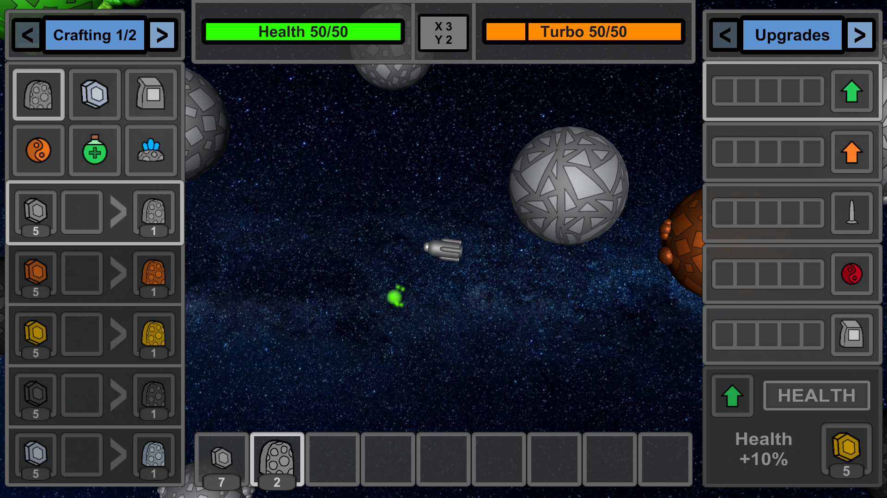
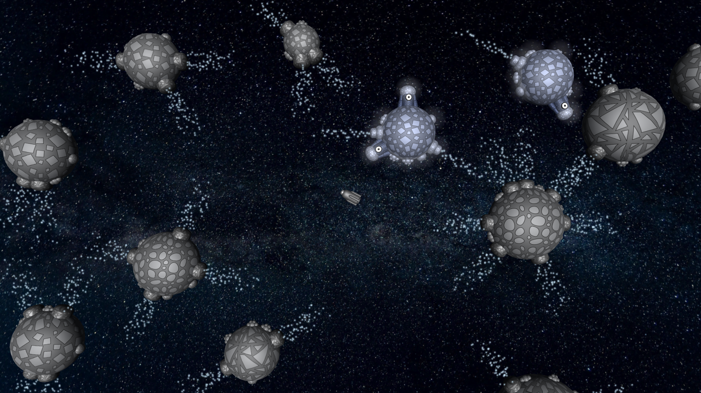
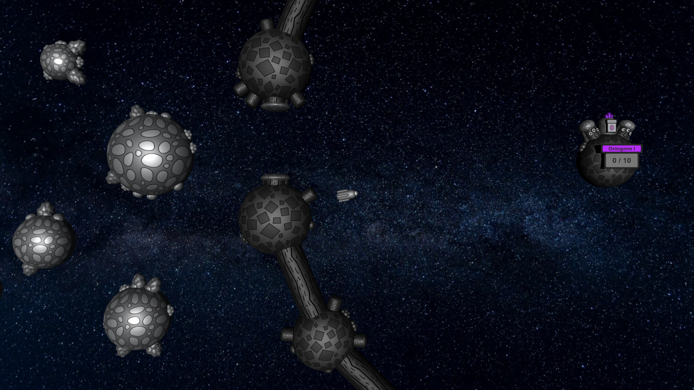
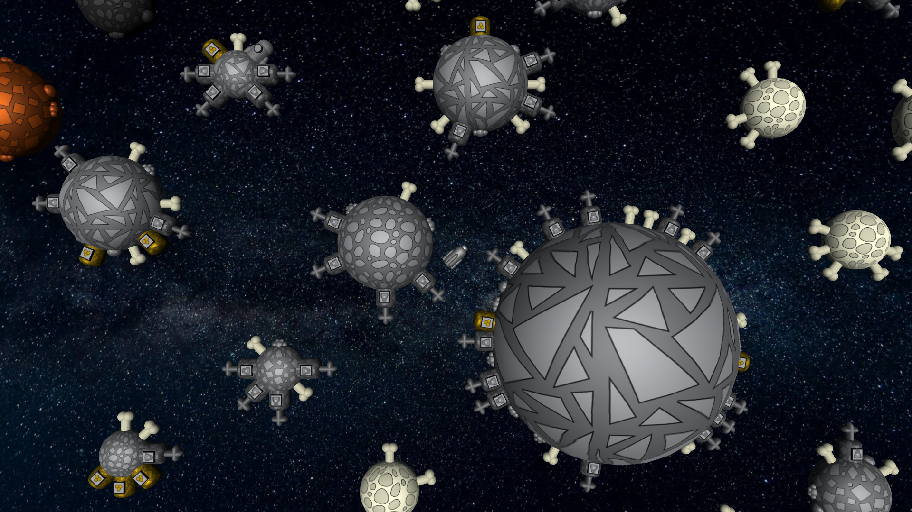
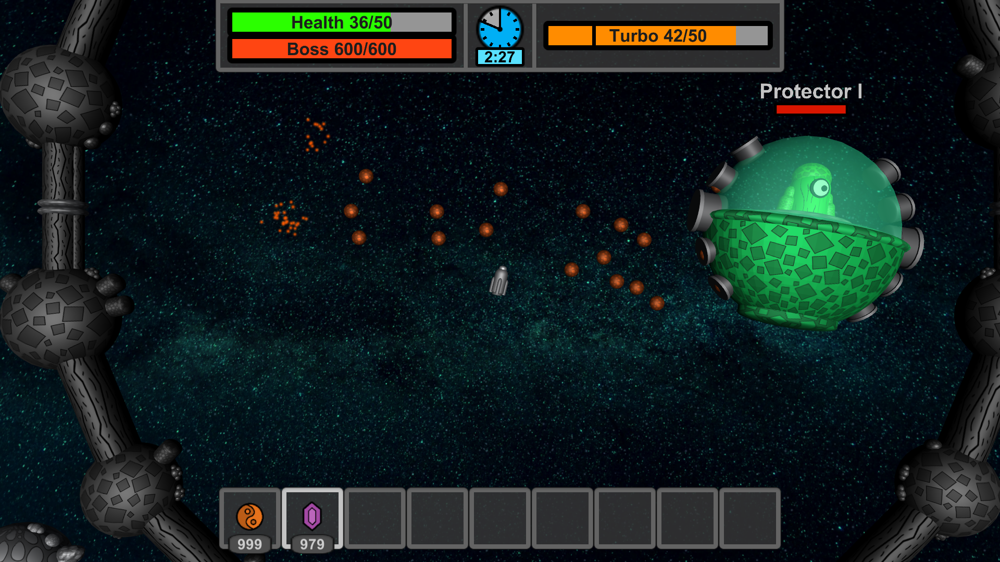
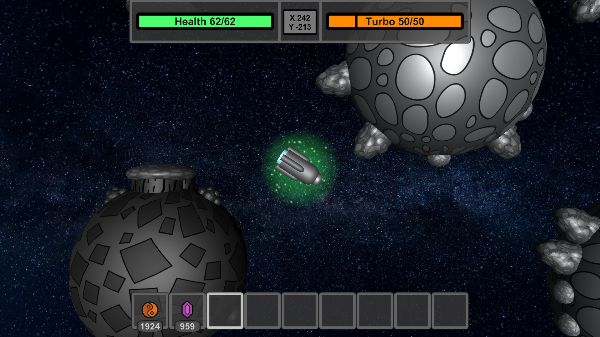

# How to play

You should read this tutorial before starting your gameplay. You will learn
how to play, what you can find in the universe and how to use it properly.

|  |
| -------------------------------------------- |

## Basics

After joining your first universe you will appear at spawn. This is the center of your procedurally generated world and
the default respawn point.

|  |
| -------------------------------------------- |

Hold space, left shift (turbo) or left alt (brake) to activate your engine. The spaceship will always rotate towards your cursor.

|  |  |
| -------------------------------------------- | -------------------------------------------- |

You can obtain items by picking them up or by drilling in asteroids.
Items are collected using LMB and placed using RMB. You can extend/retract your drill by pressing `R`.

|  |  |
| -------------------------------------------- | -------------------------------------------- |

You can learn more controls [here](/controls).

## Crafting

You can open crafting by pressing `E`. All available recipes will appear in the left UI segment.

|  |
| ----------------------------------------------- |

## Upgrades

Upgrades can be found in the right UI segment along with [backpack](#backpack) and [junkyard](#junkyard).
They allow you to make your spaceship better and stronger.

|  |
| ----------------------------------------------- |

| Feature  | Description                                        |
| -------- | -------------------------------------------------- |
| Health   | Improves health by 10% per upgrade.           |
| Turbo    | Improves turbo max speed by 8% per upgrade.   |
| Drill    | Improves drill efficiency by 12% per upgrade. |
| Bullets  | Improves bullet damage by 8% per upgrade.     |
| Backpack | Unlocks 3 backpack slots every upgrade.    |

Every feature can be upgraded 5 times. The first upgrade costs 5 gold,
then 10, 15, 20 and 25.

## Backpack

You can find backpack in the right UI segment. To unlock it, you need to upgrade backpack in the [upgrade window](#upgrades).
Every upgrade unlocks 3 slots. Backpack contains the [artefact](#artefacts) slot too, which is always unlocked.

|  |
| ----------------------------------------------- |

To insert item into backpack press the `^` button over the item slot.
- RMB - to move all items
- LMB - to move only one item

When you want to get the item back, click the slot in the backpack.  

## Junkyard

You can discard items using junkyard. It can be found in the right UI segment.
The discard slot works pretty much like slots in [backpack](#backpack), but after
pressing discard button, all items from this slot will be removed.

|  |
| ----------------------------------------------- |

## Health

You can see your health bar in the upper UI segment. When you lose health, it will regenerate quite fast,
but you can use some [potions](#potions) to regain part of it instantly.

|  |  |
| -------------------------------------------- | -------------------------------------------- |

Note: Exploding will result in losing all of your items and upgrades! It can be prevented by using keep inventory
or playing more carefully.

## Respawn

The respawn point can be set using respawn item, craftable from copper and gold.

|  |  |
| ---------------------------------------------- | ---------------------------------------------- |

## Storages

If you want to store your treasures in a safe location, you can craft and place a storage.
Using LMB and RMB you will be able to transfer items between storage and your inventory.

|  |
| --------------------------------------------- |

## Navigation

The universe in SE3 is procedurally generated, which means, that it feels infinite.
There are some features, that can help you know, where you are.
Compass between health and turbo bar points you to a respawn point.
When you click it, it will turn into coordinates.

|  |
| --------------------------------------------- |
|  |

## Locations

In the SE3 universe you can find various locations:

| ID | Location | Chance | Preview | Description |
|---|---|---|---|---|
| 0 | Default Biome | - |  | The default universe generation. |
| 1 | Hell Biome | 8% |  | The hellish biome with coal and evil aliens everywhere. |
| 2 | Geyzer Biome | 8% |  | The windy biome really hard to navigate through. |
| 3 | Alien Biome | 8% |  | The fascinating location full of cosmic friends. |
| 4 | Arena | 4% |  | Home for the boss and the challenge for players. |
| 5 | Catastrophic Arena | 0.4% |  | ??? |
| 6 | Cementery | 2.7% |  | Aliens are buried here along with their treasures. |
| 7 | Dark Cementery | 1.3% |  | The more hellish cementery variant. |
| 8 | Star | 1.5% |  | The mysterious source of heat and power. |
| 9 | Copper Facilities | 0% | Image not available yet | Coming soon! |

## Boss fights

Boss fights are the main element of the entire gameplay. You can manage
them using an in-world UI in the center of the arena. To summon a boss, you
need 10 amethyst. Put it into a special bedrock storage and click "battle".

|  |  |
| -------------------------------------------- | -------------------------------------------- |

To get access to the artefact, you need to defeat a boss 3 times. Every battle activation requires 10 amethyst.
Every boss appears in 3 phases: I, II and III. They are marked in the arena UI and as the part of a boss nick.
After defeating boss in one phase, you will upgrade your arena to the next, which means, that boss will have
more health and more available attacks in the next battle. When you defeat a boss in phase III,
you will get access to the artefact. Boss gains more hp every phase and it has access to more types of attacks.
When you are about to die or you can't defeat an activated boss in time, you can always give up. Do
this by pressing `escape` button and by clicking `Give Up`. The battle will end, but you will lose your amethyst.

|  |
| -------------------------------------------- |

There are currently 5 types of bosses. Every one of them is presented in the table below.

| ID | Name | Image | Description |
|---|---|---|---|
| 1 | Protector  |  | There are gosspis, that it is Protector, which is regularly seen on Earth. Anyway, it's just a regular UFO, nothing too spectacular... right? |
| 2 | Adecodron |  | It's neither the machine, nor the alien, but it's certainly very dangerous with its spikes, poisonous attacks and the very high speed. |
| 3 | Octogone |  | The giant octopus-like monster from the other dimension. However, this giant creature really dislikes being called a space octopus. |
| 4 | Starandus |  | The machine so advanced, that it was able to compress a star and use the nuclear fusion as an unlimited source of power. |
| 6 | Degenerator |  | It is said, that Degenerator is actually the evil version of Protector, but no one knows how it exactly became such. |

## Bullets

Bullets are used to deal damage. There are currently 5 types of them
available for player use. Damage presented in the table can be increased through upgrades.

| Bullet   | Icon                                          | DPS     | Bullet cooldown | Bullet speed | Description                                                                                           |
| -------- | --------------------------------------------- | ------- | --------------- | ------------ | ----------------------------------------------------------------------------------------------------- |
| Copper   |  | 21.43   | 0.14s           | 0.45         | A default bullet, made of copper.                                                                     |
| Red      |  | 28.57   | 0.14s           | 0.45         | A stronger bullet, made of red stone.                                                                 |
| Wind     |  | 14.29   | 0.14s           | ?         | A weaker bullet, made of coal, mainly for fire bullet production.                                     |
| Fire     |  | 23.86\* | 0.22s           | 0.40         | A bullet, which sets enemies on fire. Starandus is immune to it.                                      |
| Unstable |  | 35.71   | 0.28s           | 0.40         | The strongest, but the rarest bullet. Degenrator and players with unstable artefact are immune to it. |

\* Fire damage to other players is reduced to +?.

## Potions

There are currently 6 types of potions available. They give you some very useful effects. You can obtain them by combining common materials
with magic ingredients in crafting or by getting them from cementery treasures. You can use your potion by clicking RMB on a screen when
holding it. If you can't use a potion because of no future effect there will appear text "Potion blocked" so that you won't waste it.
Here is the list of all potions and their properties:

| Potion  | Icon                                           | Description                                                                                                           |
| ------- | ---------------------------------------------- | --------------------------------------------------------------------------------------------------------------------- |
| Healing |  | Adds 20 hp to your health bar.                                                                                        |
| Turbo   |  | Refills your turbo bar.                                                                                               |
| Power   |  | Refills your power bar. Only available when wearing impulse, illusion or unstable artefact.                           |
| Blank   |  | Adds 15 hp to your health bar. Removes effect like fire, poison or stickybulb.                                        |
| Killing |  | Removes 15 hp from your health bar. If you're wearing unstable artefact, it will also add 10 power to your power bar. |
| Max     |  | Refills your health, turbo and power bars and removes effect. Only obtainable from dark cementeries.                  |

## Artefacts

Artefacts are the most powerful items in the universe. They give you
some special powers, when you wear them. You can obtain them by defeating bosses.
Every boss gives you a specified artefact. After defeating boss in phase III, there
will appear an asteroid with the artefact instead of battle menu in the center of arena.
You can pick it up like other items and then move it into a special artefact slot using button "SET".

|  |  |
| ----------------------------------------------- | ----------------------------------------------- |
|  |  |

| Icon                                          | Artefact    | Boss        | Description                                                                                                                                          |
| --------------------------------------------- | ----------- | ----------- | ---------------------------------------------------------------------------------------------------------------------------------------------------- |
|  | Protection  | Protector   | The super health bar upgrade. It improves your health by 25%, speeds up health regeneration by 1.5 and reduces health regeneration cooldown by half. |
|  | Impulse     | Adecodron   | Allows you to make impulses, when you have enough power. You can use it for attack, defense or just for fun.                                         |
|  | Illusion    | Octogone    | Allows you to become invisible to bosses and other players. It makes you 20% faster and immune to crash damage when active.                                                                                          |
|  | Immortality | Starandus   | When you wear it and die, you won't die, but your artefact will turn gray. Recharge it using star wind near the star.                                            |
|  | Unstable    | Degenerator | That's a mystery. All ancient notes were lost. Figure it out by yourself, but do not kill anyone by accident.                                                                            |
