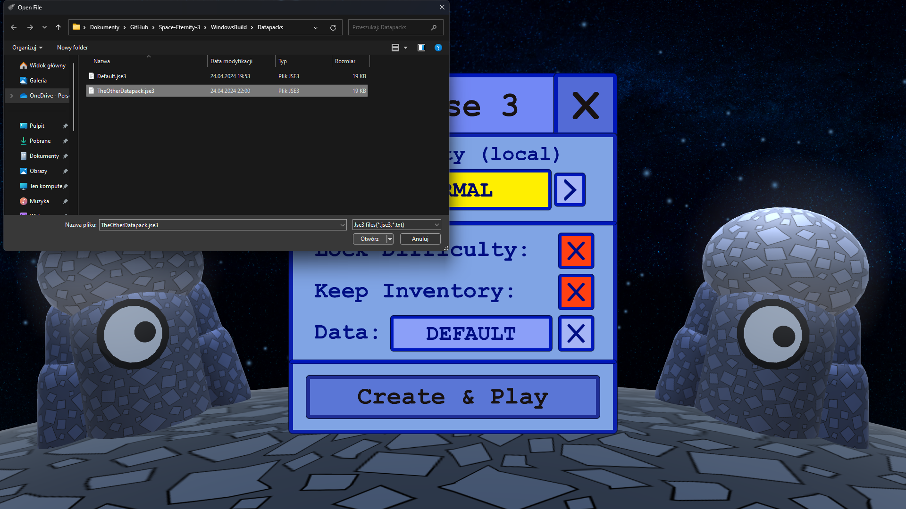

# Datapacks

Datapacks allow you to customize your gameplay in the specified universe. You can select a datapack, which will be used
when creating the universe. Just click on the button "DEFAULT" and select your datapack from the file selector.
You can reset your loaded datapack to default using "X" button.

|  |
| ----------------------------------------------- |

You can create your own datapack or download it from someone else. There is
a default datapack copy in `Datapacks` folder, so you can copy and edit it. More
info about the jse3 format (SE3 datapack format) in [SE3 documentation](/documentation).
It might be required to use a professional text editor like Notepad++ or Visual Studio to access
datapack content.  

To use a datapack on the server just put the file into the analogous `Datapacks` folder.
Be sure that `ServerUniverse` folder and especially file `ServerUniverse/UniverseInfo.se3`
(it stores the imported datapack) doesn't exist.

- Universes with custom datapack will have "Custom data" subtitle.  
- You shouldn't change datapack of the universe after it is created, unless it doesn't affect SEON code.  
- Universes with custom datapack can't be easily updated to newer versions.  
