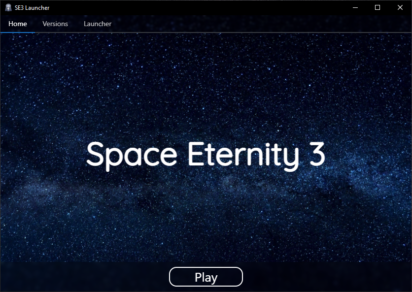

import BrowserOnly from "@docusaurus/BrowserOnly";
import DownloadButton from "@site/src/components/DownloadButton";

# Download page

export const System = () => {
    if (window.navigator.userAgent.indexOf("Windows") != -1) return "Windows";
    if (window.navigator.userAgent.indexOf("Mac") != -1) return "Mac";
    if (window.navigator.userAgent.indexOf("Linux") != -1) return "Linux";
    return null;
};

export const DownloadLink = () => {
    switch (System()) {
        case "Windows":
            return "https://github.com/Space-Eternity-3/SE3-Launcher/releases/download/v3.0.3/se3-launcher-3.0.3-win-x64-setup.exe";
        case "Linux":
            return "https://github.com/Space-Eternity-3/SE3-Launcher/releases/download/v3.0.3/se3-launcher-3.0.3-linux-x86_64.AppImage";
    }
    return null;
};

export const GetMessage = () => {
    const system = System();
    switch (system) {
        case "Windows":
        case "Linux":
            return `Download for ${system}`;
    }
    return "Your system is unsupported";
};

## SE3 Launcher v3.0.3 (latest)

:::note
SE3 is only available on computers with Windows or Linux.
:::

|  |
| --- |

:::info
Only official Betas and Releases are available through launcher. To play the latest snapshot, see [testing page](./testing).
:::

<BrowserOnly>{() => <DownloadButton text={GetMessage()} url={DownloadLink()} />}</BrowserOnly>

### All downloads

-   Windows x64
    -   [Installer](https://github.com/Space-Eternity-3/SE3-Launcher/releases/download/v3.0.3/se3-launcher-3.0.3-win-x64-portable.exe)
    -   [Portable (.zip)](https://github.com/Space-Eternity-3/SE3-Launcher/releases/download/v3.0.3/se3-launcher-3.0.3-win-x64-portable.zip)
    -   [Portable (.exe)](https://github.com/Space-Eternity-3/SE3-Launcher/releases/download/v3.0.3/se3-launcher-3.0.3-win-x64-portable.exe)
-   Linux
    -   [deb](https://github.com/Space-Eternity-3/SE3-Launcher/releases/download/v3.0.3/se3-launcher-3.0.3-linux-amd64.deb)
    -   [tar.gz](https://github.com/Space-Eternity-3/SE3-Launcher/releases/download/v3.0.3/se3-launcher-3.0.3-linux-x64.tar.gz)
    -   [AppImage](https://github.com/Space-Eternity-3/SE3-Launcher/releases/download/v3.0.3/se3-launcher-3.0.3-linux-x86_64.AppImage)
    -   [rpm](https://github.com/Space-Eternity-3/SE3-Launcher/releases/download/v3.0.3/se3-launcher-3.0.3-linux-x86_64.rpm)

## Github links

[View Space Eternity 3 on GitHub](https://github.com/Space-Eternity-3/Space-Eternity-3) (by Kamiloso)  
[View SE3 Launcher on GitHub](https://github.com/Space-Eternity-3/SE3-Launcher) (by Nadwey)  
[View SE3 Website on GitHub](https://github.com/Space-Eternity-3/SE3-Website) (by Kamiloso & Nadwey)  
