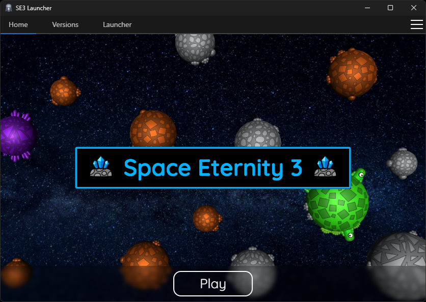

import BrowserOnly from "@docusaurus/BrowserOnly";
import DownloadButton from "@site/src/components/DownloadButton";

# Download page

export const System = () => {
    if (window.navigator.userAgent.indexOf("Windows") != -1) return "Windows";
    if (window.navigator.userAgent.indexOf("Mac") != -1) return "Mac";
    if (window.navigator.userAgent.indexOf("Linux") != -1) return "Linux";
    return null;
};

export const DownloadLink = () => {
    switch (System()) {
        case "Windows":
            return "https://github.com/Space-Eternity-3/SE3-Launcher/releases/download/v3.0.6/se3-launcher-3.0.6-win-x64-setup.exe";
        case "Linux":
            return "https://github.com/Space-Eternity-3/SE3-Launcher/releases/download/v3.0.6/se3-launcher-3.0.6-linux-x86_64.AppImage";
    }
    return null;
};

export const GetMessage = () => {
    const system = System();
    switch (system) {
        case "Windows":
        case "Linux":
            return `Download for ${system}`;
    }
    return "Your system is unsupported";
};

## SE3 Launcher v3.0.6 (latest) {#launcher}

Launcher makes updating SE3 much easier and gives you easy access to older versions of the game.

:::note
SE3 is only available on computers with Windows or Linux. If you encounter any problems during
installation, see [direct download](#direct-download).
:::

|  |
| --- |

<BrowserOnly>{() => <DownloadButton text={GetMessage()} url={DownloadLink()} />}</BrowserOnly>

<h3> All downloads </h3>

-   Windows x64
    -   [Installer](https://github.com/Space-Eternity-3/SE3-Launcher/releases/download/v3.0.6/se3-launcher-3.0.6-win-x64-portable.exe)
    -   [Portable (.zip)](https://github.com/Space-Eternity-3/SE3-Launcher/releases/download/v3.0.6/se3-launcher-3.0.6-win-x64-portable.zip)
    -   [Portable (.exe)](https://github.com/Space-Eternity-3/SE3-Launcher/releases/download/v3.0.6/se3-launcher-3.0.6-win-x64-portable.exe)
-   Linux
    -   [deb](https://github.com/Space-Eternity-3/SE3-Launcher/releases/download/v3.0.6/se3-launcher-3.0.6-linux-amd64.deb)
    -   [tar.gz](https://github.com/Space-Eternity-3/SE3-Launcher/releases/download/v3.0.6/se3-launcher-3.0.6-linux-x64.tar.gz)
    -   [AppImage](https://github.com/Space-Eternity-3/SE3-Launcher/releases/download/v3.0.6/se3-launcher-3.0.6-linux-x86_64.AppImage)
    -   [rpm](https://github.com/Space-Eternity-3/SE3-Launcher/releases/download/v3.0.6/se3-launcher-3.0.6-linux-x86_64.rpm)

## Direct download + Source code {#direct-download}

:::info
You can download the latest version of SE3 directly from [this page](https://github.com/Space-Eternity-3/Space-Eternity-3/releases/tag/release%2FRelease-2.3).
Source code is also included. Note, that this way you will not be informed about future updates.
:::

## GitHub links

* [The SE3 GitHub organization](https://github.com/Space-Eternity-3)  
* [Space Eternity 3](https://github.com/Space-Eternity-3/Space-Eternity-3) - by Kamiloso
* [SE3 Server](https://github.com/Space-Eternity-3/SE3-Server) (separated from game files) - by Kamiloso
* [SE3 Website](https://github.com/Space-Eternity-3/SE3-Website) - by Kamiloso & Nadwey
* [SE3 Launcher](https://github.com/Space-Eternity-3/SE3-Launcher) - by Nadwey
