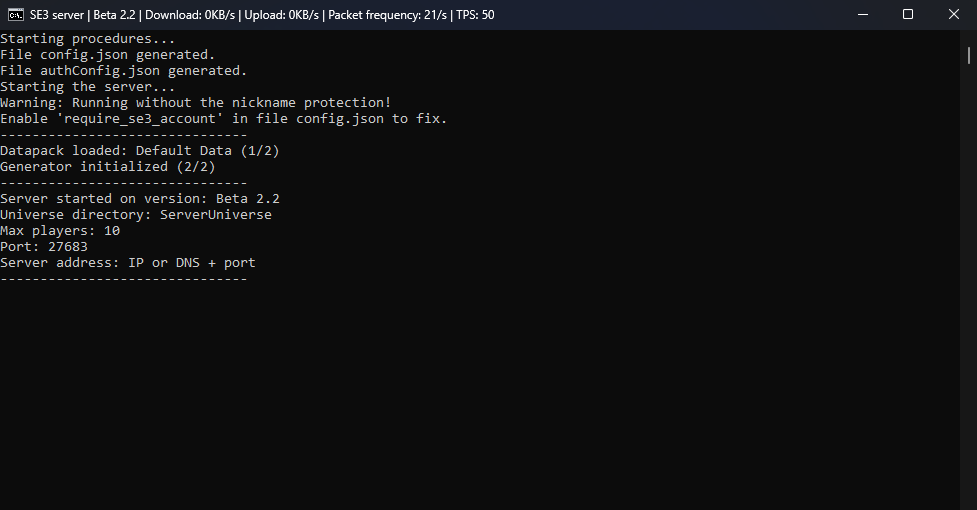

import DownloadButton from "@site/src/components/DownloadButton";
import AllServerDownloads from "@site/src/components/AllServerDownloads";

# Multiplayer server for SE3

To play SE3 with your friends, you need to download and run the server on your own computer.

|  |
| ----------------------------------------------- |

## Download server

| Version  | Download (.zip)  | Download (.tar.gz)  |
|---|---|---|
| Release 2.3 (latest) | <a href="https://github.com/Space-Eternity-3/SE3-Server/archive/refs/heads/Release-2.3.zip">SE3 Server - Release 2.3 (.zip)</a> | <a href="https://github.com/Space-Eternity-3/SE3-Server/archive/refs/heads/Release-2.3.tar.gz">SE3 Server - Release 2.3 (.tar.gz)</a> |

:::info
Older servers can be found in [this repository](https://github.com/Space-Eternity-3/SE3-Server/).
Ancient servers from before `Beta 1.13` are present in game files all the way back to `Beta 1.3`.
:::

## Running server on Windows

-   Download server from the links above and unpack it.
-   Download [Node.js](https://nodejs.org/en/download/).
-   Go to the server directory (with `index.js`).
-   Run `Configure.bat` file to configure (or type `npm i` in console).
-   Run `Server.bat` file to start the server (or type `node index.js` in console).
-   [Join to your server](#joining-to-your-server).

|  |
| --- |

## Running server through console (Windows, Linux, MacOS)

Prerequisites:

-   Git
-   Node.js

Go to the directory where you want to create your server and run the following commands:

```bash
git clone https://github.com/Space-Eternity-3/SE3-Server.git
cd SE3-Server
npm i
node index.js
```

Then [join to your server](#joining-to-your-server).

## Joining to your server

When you start your server, it will be visible for computers in your local network (LAN) on port 27683. To join, you should type `ws://local.ip:27683` or `ws://local.ip:` in the
server address field, where local.ip is your local IP address, for example `192.168.0.10`. 

To allow joining to your server from the internet, you need to forward port 27683 on your router. Read more on [portforward.com](https://portforward.com).
Then you need to check your public IP address on [whatismyip.com](https://whatismyip.com). When you forward a port, everyone will be able to join to your
server using address `ws://public.ip:27683` or `ws://public.ip:`, where public.ip is your public IP address.

:::tip
If you can't for some reason forward ports, you can use page [playit.gg](https://playit.gg) or any similar page to tunell TCP traffic through the external server with ports already forwarded.
Note, that this way you will increase your server's ping.
:::

## Protecting your server

Servers don't automatically have nickname protection enabled, so anyone can join using any nickname.
To fix this, follow instructions after starting the server.
You will need the registered SE3 account, which can be created in the game main menu.
Every player who wants to join will have to log in to their SE3 account and use the special `se3://` redirect address, which you
can customize for your server during configuration.

:::warning
This system is fully safe only when you use the SSL protocol (`wss://` instead of `ws://`), however if you
just want to play with your friends, it should be enough.
:::
